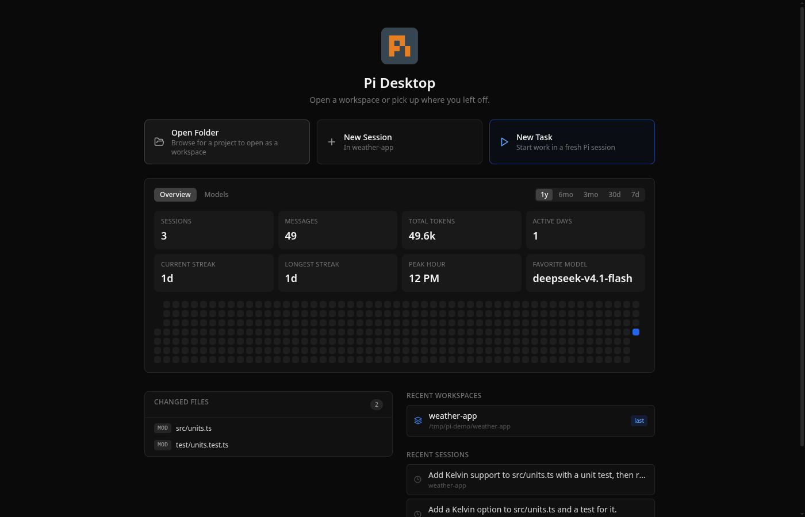

# Pi Desktop

A desktop GUI for the [Pi](https://pi.dev) and [oh-my-pi](https://github.com/can1357/oh-my-pi) coding agents. Chat, manage projects, browse files, run commands, and install packages in one window.



Pi Desktop is in alpha, so expect rough edges.

## What it does

- Streaming chat with thinking blocks and tool calls. Consecutive tool calls fold into groups, file reads show as line-numbered code, and edits show as diffs. SVG blocks render inline, and file names in replies open a preview pane
- Composer with `@` file mentions, prompt recall with `Up`/`Down`, a model picker you can drive from the keyboard, and file or image attachments (pick, paste, or drop them)
- Find in the conversation (`Ctrl/Cmd+F`) and a quick switcher (`Ctrl/Cmd+K`) for commands, skills, prompt templates, workspaces, sessions, and files
- Multiple workspaces with project tabs you can drag to reorder. Each live session runs its own agent process, so a turn keeps running after you switch away. Mission Control and sidebar activity dots show background work, and desktop notifications tell you when a session finishes, fails, or waits for approval
- New Task starts a fresh session in a project and sends the task right away, optionally in an isolated Git worktree
- Right-edge tool rail that opens the Review panel, file tree, diff viewer, and terminal
- Diff viewer with a filter for the files the session touched, per-file discard, and a Git bar with Commit, Commit + Push, Push, and PR (it becomes Open PR #N when the branch has an open pull request). In the Commit dialog, **Suggest message** asks the session's model for a commit message, and new files are committed only if you check them. The status bar has a branch menu to switch branches or create a new one
- Code, image, PDF, and HTML previews, a CodeMirror 6 editor with Git change markers, and workspace file search
- Resizable terminal, one per workspace
- [Permission modes and custom allow/deny rules](#permissions), global or per workspace
- Workflow runs viewer for the pi-dynamic-workflows extension, with Abort and Resume
- Skills browser, session fork/branch tree, session tags, inline session rename, and one-click context compaction
- Home dashboard with usage stats: messages, tokens, active-day streaks, peak hour, and a per-model breakdown
- Diagnostics view: Pi/OMP install and PATH resolution, provider configuration, permissions, and recent errors
- Package browser for pi.dev/packages, with local search and update checks for installed packages
- Custom models and providers editor, which edits your engine's models file (`~/.pi/agent/models.json` for Pi, `~/.omp/agent/models.yml` for OMP)
- [Keyboard shortcuts](#keyboard-shortcuts) you can change in Settings, [themes](#custom-themes) (7 built-ins, System, and your own), and a UI font setting
- [Multi-Agent Council Planning](#multi-agent-council-planning): Pi, Claude, and Codex plan together before Pi builds (opt-in)
- [TypeSafe Jev](#typesafe-jev): save your TypeSafe API key once and install the Jev skill for Pi and OMP (opt-in)
- [Voice dictation](#voice-dictation) that runs on your machine with a model you pick (opt-in)
- [Translatable interface](#languages) (English and Simplified Chinese ship today)

## Review panel

The Review panel shows the permission mode, pending approvals, changed files, and session status while you chat with Pi. It is hidden by default. Open it from the right-edge tool rail or with `Ctrl/Cmd+Shift+U`.

Changed files use these status badges:

| Badge | Meaning |
|-------|---------|
| `NEW` | Untracked new file |
| `MOD` | Existing tracked file was modified |
| `DEL` | Tracked file was deleted |
| `ADD` | New file staged in git |
| `STG` | Modified file staged in git |
| `REN` | File was renamed |

## Pi and OMP engines

Pi Desktop speaks Pi's RPC protocol, so it can run either the standard `pi` CLI or the compatible `omp` binary from [oh-my-pi](https://github.com/can1357/oh-my-pi). **Settings > Agent Configuration > Agent Installation** finds installed engines and lets you pick one, or point it at a custom executable or install directory.

Each engine keeps its own sessions: Pi writes to `~/.pi/agent/sessions`, OMP to `~/.omp/agent/sessions`. The app reads both, so switching engines never hides your history. When sessions from both appear in one list, each row is tagged `Pi` or `OMP`, and opening one starts the engine that wrote it. Under OMP, package actions use OMP's plugin commands.

If `~/.pi/.env` exists, its variables (provider API keys, for example) are passed to every Pi or OMP process and to the terminal. A variable already set in the environment wins.

## Permissions

Four base modes control what Pi may do. Pick one in the composer, the Review panel, or **Settings > Behavior**:

| Mode | Behavior |
|------|----------|
| Plan / Read-only | Only read/search/list tools are enabled; edits and shell commands are blocked |
| Ask before edits | Pi asks before file edits and shell commands |
| Ask before commands | Pi asks before shell commands |
| Trusted | All tools enabled |

The default is Ask before edits.

Custom permission rules refine the modes with allow/deny rules per Pi tool, edited in **Settings > Behavior > Permission Rules**:

- A rule has an action (`allow` or `deny`), a tool name (`bash`, `edit`, `write`, `read`, and so on, or `*` for any tool), and an optional glob pattern matched against the tool's input: the shell command for `bash`, the file path for file tools. `*` is the only wildcard.
- Deny beats allow, and allow beats the mode default. Deny rules apply in every mode, so a `deny * *.env*` rule holds even in Trusted. Allow rules skip the confirmation prompt in the ask modes.
- Rule edits apply to the next tool call without restarting Pi.
- The **Global** and **This workspace** tabs edit your global rules or the active workspace's `.pi-desktop/permission-rules.json`. A workspace file depends on workspace trust. After you trust the workspace, its file replaces the global list while you work there. Until then (the default for a repo you just opened), only its deny rules apply, on top of your global rules, and its allow rules are ignored. A cloned repo can tighten your permissions but never loosen them. Opening a workspace whose file has allow rules asks you to trust it, and the **This workspace** tab has Trust and Revoke controls. Import and Export move rule lists as JSON files. You can also edit the workspace file by hand or commit it with the repo; the app picks up changes live.
- Rules match raw strings, with no path canonicalization or command parsing. Treat them as a guard against accidents, not a security sandbox, and keep even a trusted workspace's allow rules narrow.

Example rules:

```json
{ "action": "allow", "tool": "bash", "match": "npm test*" }
{ "action": "deny",  "tool": "bash", "match": "rm -rf *" }
{ "action": "deny",  "tool": "*",    "match": "*.env*" }
```

## Custom themes

Pi Desktop ships 7 built-in themes (Dark, Light, Nord, Gruvbox, Breeze Dark, Breeze Light, Breeze Claudius) plus System, the default. You can also create your own in **Settings > Appearance**. With **System** selected, **Light Theme** and **Dark Theme** choose which installed theme each OS mode uses.

Click **Create theme** to fork the active theme, or **Edit theme** to keep editing one you created. Pick 7 seed colors (app background, surface, text, accent, success, warning, error) and a dark or light kind. The app derives every other color from those seeds, and the whole window previews your changes as you edit. Two sections give finer control:

- **Advanced** overrides individual derived tokens (borders, hovers, scrollbars, and so on).
- **Syntax colors** overrides the code-highlighting colors (keywords, strings, comments, and so on) in the code editor and diff viewer.

Your themes appear next to the built-ins in the **Theme** dropdown. To rename a theme, edit its name in the editor. To duplicate one, select it and click **Create theme**. To delete one, select it and click **Delete** under **Theme Actions**.

To share a theme, use **Import** and **Export** to move it as a `.json` file, or paste an `https://` URL into the field under **Theme Actions** and click **Install**. Plain HTTP URLs are refused, and downloads have a size limit.

A theme file uses the `pi-theme/v1` format: JSON with a `$schema`, a `name`, a `kind` (`"dark"` or `"light"`), and 7 `seeds`. That is enough for a complete theme; the app derives the rest with CSS `color-mix()`:

```json
{
  "$schema": "pi-theme/v1",
  "name": "My Theme",
  "kind": "dark",
  "seeds": {
    "app": "#0a0a0a",
    "surface": "#171717",
    "text": "#f5f5f5",
    "accent": "#2563eb",
    "success": "#34d399",
    "warning": "#facc15",
    "error": "#f87171"
  }
}
```

Two optional top-level objects pin exact values instead of derived ones: `overrides` (any derived token, such as `border`, `scrollbar`, or `accent-hover`) and `syntax` (code-highlighting colors, such as `keyword`, `string`, or `comment`). Without them, the theme renders from the 7 seeds alone.

User theme files live in the app's data directory under `themes/` (on Linux, `~/.config/pi-desktop/themes/`).

**Browse gallery** under **Theme Actions** opens the community gallery, [pi-desktop-themes](https://github.com/FaqFirebase/pi-desktop-themes), where you can preview and install themes. To add your own theme to it, open a pull request there.

## Languages

Pick the interface language in **Settings > Appearance > Language**. **System default** follows your operating system's language list and falls back to English. The change applies when you click **Save Settings**, with no restart.

English and Simplified Chinese are bundled today. Each language is one JSON file in `resources/locales/<code>/translation.json`; see [Translations](CONTRIBUTING.md#translations) to add one.

Only the app's own text is translated. Chat replies, file contents, and names of models, packages, and sessions stay as they are. Logs and the copied Diagnostics report stay in English, so bug reports stay readable.

## Multi-Agent Council Planning

Pi, Claude, and Codex each write a plan, and Pi merges them into one consensus plan before anything is built. Pi is the only agent that edits files.

The feature is off by default. Turn it on in **Settings > Multi-Agent Council Planning**. A confirmation dialog warns that each request runs several agents, which costs more tokens and credits.

The app detects each member's CLI, and you can enable only the agents it finds. A run needs at least two members. Pi always merges the plans, even when it is not checked as a planner.

Every member plans read-only: Claude runs with `--permission-mode plan`, Codex with `--sandbox read-only`, and Pi without its write tools. Each member streams its plan into its own card with an elapsed timer.

There are two consensus modes:

- **One debate round** (default): each member reads the others' plans and revises once, then Pi merges them.
- **Arbiter merge**: faster and cheaper. Pi merges the first plans directly.

A per-member timeout (10 to 600 seconds, default 240) limits each member. A member that times out or fails is dropped, and the run continues if at least one plan came back.

To use it, type your request and click **Plan with Council** in the composer. Read each member's plan and the merged plan. To change it, type feedback in **Request changes to the plan…** and Pi revises the plan. When it looks right, click **Implement this** and Pi builds it.

## TypeSafe Jev

[Jev](https://docs.typesafe.ai/introduction) is TypeSafe's judgment model. It does not write text. It answers typed questions with yes/no probabilities, scores, and choices that code can use directly.

Nothing happens until you set it up in **Settings > TypeSafe Jev**:

- **API key**: paste a key from the [TypeSafe console](https://console.typesafe.ai/keys). The app saves it in its own file in the app's data folder, readable only by your user account, and never in `settings.json`. Every new Pi or OMP session gets it as `TYPESAFE_API_KEY`. If that variable is already set in the environment Pi Desktop started with, that value wins. Restart an open session to give it the key.
- **Jev skill**: installs TypeSafe's official [agent skill](https://docs.typesafe.ai/agent-skill) into `~/.agents/skills`, where both Pi and OMP find it. The files come from a pinned release and are checked before install.

Then ask the agent to use TypeSafe. Pi Desktop never calls TypeSafe itself.

To learn more, see the TypeSafe [quickstart](https://docs.typesafe.ai/introduction/quickstart), [models and pricing](https://docs.typesafe.ai/models), and [API reference](https://docs.typesafe.ai/api).

## Voice dictation

Click the microphone in the composer and start talking. Your words show up in the prompt box while you speak, and recording stops after a short pause (or click the mic to stop). The text stays in the box for you to read and edit; the app never sends it for you.

Speech-to-text runs on your own computer. No model ships with the app and none is selected by default, so nothing downloads until you choose one in **Settings > Voice dictation**. The model you pick downloads once, with a progress bar, into the app's data folder.

The right model depends on your machine and language. Moonshine is small and fast and handles English well, so it is a good first choice. Whisper covers many languages. Parakeet V3 is the most accurate and also covers many languages, but it is a much larger download. Bigger models are more accurate but run slower and use more disk. Models use your graphics card when there is one and fall back to the processor otherwise.

## Getting started

You need Pi installed first:

```bash
npm install -g @earendil-works/pi-coding-agent
```

On Linux, grab the AppImage from [Releases](https://github.com/FaqFirebase/pi-desktop/releases):

```bash
chmod +x Pi-Desktop-*.AppImage
./Pi-Desktop-*.AppImage
```

### macOS

Download the `.dmg` (Apple Silicon / arm64) from [Releases](https://github.com/FaqFirebase/pi-desktop/releases), open it, and drag **Pi Desktop** to Applications.

Builds are **not signed or notarized** yet. macOS quarantines the unsigned download, and on first launch Gatekeeper shows this dialog (this is macOS's wording, not our advice):

> Pi Desktop is damaged and can't be opened. You should move it to the Trash.

**Do not move it to the Trash.** The app is not damaged; Gatekeeper uses this wording to block any unsigned app. This dialog has no "Open Anyway" button, so clear the quarantine flag in Terminal instead:

```bash
xattr -dr com.apple.quarantine "/Applications/Pi Desktop.app"
```

Then open the app normally. You only need to do this once.

> If macOS instead says the app **"cannot be opened because Apple cannot check it for malicious software,"** you can allow it without Terminal: open **System Settings > Privacy & Security**, scroll to the **Security** section, click **Open Anyway** next to the Pi Desktop notice, and confirm with Touch ID or your password.

> To skip the unsigned-app warnings, build from source. Gatekeeper does not block a build you compile yourself, so there is no quarantine flag to clear. See [Build it yourself: Linux / macOS](#linux--macos) below.

### Windows

Download the **installer** (`…-win-x64-setup.exe`, recommended) or the **portable** `…-win-x64.exe` from [Releases](https://github.com/FaqFirebase/pi-desktop/releases). Builds are unsigned, so SmartScreen may warn; choose **More info > Run anyway**. If file edits or saves fail, see the [Controlled Folder Access](#controlled-folder-access-ransomware-protection) note below. Windows is community-tested, so please [open a bug report](https://github.com/FaqFirebase/pi-desktop/issues) if you hit a problem.

## Keyboard shortcuts

You can change the app shortcuts in **Settings > Keyboard shortcuts**, or turn any of them off. `Mod` is `Cmd` on macOS and `Ctrl` elsewhere. The defaults:

| Shortcut | What it does |
|----------|-------------|
| `Mod+K` | Command palette |
| `Mod+N` | New session |
| `Mod+Shift+M` | Model selector |
| `Mod+B` | Sidebar |
| `Mod+Shift+E` | File tree |
| `Mod+G` | Diff viewer |
| ``Ctrl+` `` | Terminal |
| `Mod+Shift+U` | Review panel |
| `Mod+Shift+H` | Show this session's changes in the diff; press again to Commit + Push |
| `Mod+,` | Settings |
| `Ctrl+Shift+P` | Insert a saved note |
| `Mod+[` / `Mod+]` | Previous / next open session in the project |
| `Mod+Shift+[` / `Mod+Shift+]` | Previous / next project |
| `Mod+Shift+T` (hold) | Voice dictation while held |

A system-wide voice dictation key, off by default, starts and stops dictation from any app.

These shortcuts are fixed:

| Shortcut | What it does |
|----------|-------------|
| `Enter` | Send message |
| `Shift+Enter` | New line |
| `Up` / `Down` | Recall prompts sent in this session |
| `@` | Mention a workspace file |
| `/` (start of message) | Show commands |
| `Esc` | Stop the running turn |
| `Ctrl+P` (composer focused) | Cycle model |
| `Ctrl/Cmd+F` | Find in conversation |
| `Ctrl/Cmd+Shift+F` | Search workspace files |
| `Ctrl/Cmd+Shift+N` | New workspace |
| `Ctrl/Cmd+O` | Open project |

## Build it yourself

### Linux / macOS

```bash
git clone https://github.com/FaqFirebase/pi-desktop.git
cd pi-desktop
npm install --ignore-scripts=false
npm run dev
```

`--ignore-scripts=false` runs the install scripts that prepare Electron and the native modules, even if your npm configuration turns scripts off.

### Windows

Windows needs extra steps because **node-pty** (the terminal backend) compiles a native module against Electron's ABI.

#### 1. Install prerequisites

Install these **before** cloning:

- [Git for Windows](https://git-scm.com/download/win)
- [Node.js LTS](https://nodejs.org), via the official Windows installer (adds `node` and `npm` to PATH)
- **Visual Studio Build Tools 2022**, downloaded from [Visual Studio downloads](https://visualstudio.microsoft.com/downloads/#build-tools-for-visual-studio-2022)
  - Select the **Desktop development with C++** workload
  - Open **Individual components**, search `Spectre`, and install **Spectre-mitigated libs for v143 toolset**

> **Use VS Build Tools 2022, not 2026.** node-pty needs Spectre-mitigated runtime libraries. VS 2022 stable (v143 toolset) ships them. VS 2026 preview (v180 toolset) does not, and `npm install` then fails with `MSB8040: Spectre-mitigated libraries are required for this project`.

#### 2. Add a Windows Defender exclusion (recommended)

Defender can block or slow `npm install` on projects with many small files. Before cloning, add an exclusion:

Settings > Privacy & Security > Windows Security > Virus & threat protection > Manage settings > Exclusions > Add a folder > (pick where you'll clone the repo)

#### 3. Clone and install

```powershell
git clone https://github.com/FaqFirebase/pi-desktop.git
cd pi-desktop
npm install --ignore-scripts=false
```

`--ignore-scripts=false` runs the install scripts even if your npm configuration turns them off. The postinstall script rebuilds `node-pty` against Electron's ABI and downloads the Electron binary if it is missing. The first install can take a few minutes.

If the Electron binary is still missing after install, follow the [manual Electron binary download](#manual-electron-binary-download) steps below. They fix the case where Electron's postinstall extraction leaves a partial `dist` folder.

#### 4. Install Pi

```powershell
powershell -c "irm https://pi.dev/install.ps1 | iex"
```

Open a **new terminal** afterwards so the updated PATH takes effect.

#### 5. Run

```powershell
npm run dev
```

#### Common Windows errors

| Error | Cause | Fix |
|-------|-------|-----|
| `MSB8040`: Spectre libs missing | VS Build Tools 2026 (v180 toolset) installed instead of 2022 (v143) | Uninstall 2026, install VS Build Tools 2022 with Spectre libs for v143 |
| `electron-vite is not recognized` | `npm install` didn't complete | Run `npm install` again |
| Electron binary missing after install | Electron's postinstall extraction left a partial or missing `dist` folder | Add the repo folder to Defender exclusions, then `npm install` again. If it still fails, use the manual download steps below |
| `EPERM` / `EACCES` writing a project file | Controlled Folder Access (Ransomware protection) is blocking writes under Documents/Desktop | Keep the repo and your projects out of protected folders, or allow Pi Desktop through Controlled folder access (see below) |
| Pi shows "error" in status popover | Pi not installed or PATH not updated | Run the install script above in a **new** terminal window |

#### Controlled Folder Access (Ransomware protection)

Windows **Controlled Folder Access** protects `Documents`, `Desktop`, `Pictures`, and similar folders by silently blocking untrusted apps from writing to them. If your repo or projects live in a protected folder, you get intermittent `EPERM`/`EACCES` failures during `npm install`, when the agent edits code, or when you save a file.

The reliable fix is to keep code out of protected folders. Clone the repo and keep your projects somewhere unprotected, for example:

```powershell
# Not C:\Users\<you>\Documents\...; use an unprotected path:
git clone https://github.com/FaqFirebase/pi-desktop.git C:\dev\pi-desktop
```

If your code must stay under Documents or Desktop, allow the app instead:

**Windows Security > Virus & threat protection > Ransomware protection > Manage ransomware protection > Allow an app through Controlled folder access > Add an allowed app**, then add the installed `Pi Desktop.exe` (and, for development, `node.exe`, `git.exe`, and `electron.exe`).

> The portable `.exe` extracts to a new temporary folder on each launch, so an allow-list entry for it does not last. Use the **installer** (`Pi-Desktop-<version>-win-x64-setup.exe`) if you rely on the allow list.

#### Manual Electron binary download

If `npm install` completes but the app won't launch because Electron is missing or damaged, download Electron from GitHub and unpack it into place. Use this when `node_modules\electron\dist` holds only part of its files, such as `locales`, and no `electron.exe`.

Replace `43.7.7` with the version in `node_modules/electron/package.json` if it differs.

```powershell
$ver = "43.7.7"
$url = "https://github.com/electron/electron/releases/download/v$ver/electron-v$ver-win32-x64.zip"
$zip = "$env:TEMP\electron-v$ver-win32-x64.zip"
Invoke-WebRequest -Uri $url -OutFile $zip
if (Test-Path node_modules\electron\dist) { Remove-Item -Recurse -Force node_modules\electron\dist }
Expand-Archive -Path $zip -DestinationPath node_modules\electron\dist -Force
"electron.exe" | Out-File -Encoding ASCII -NoNewline node_modules\electron\path.txt
"v$ver" | Out-File -Encoding ASCII -NoNewline node_modules\electron\dist\version
```

After this, `npm run dev` should work.

> **Note:** Windows builds are community-tested. If you hit a problem not listed above, please [open a bug report](https://github.com/FaqFirebase/pi-desktop/issues).

## License

Apache 2.0

## Links

- [pi-desktop.com](https://pi-desktop.com)
- [pi.dev](https://pi.dev)
- [Packages](https://pi.dev/packages)
- [Issues](https://github.com/FaqFirebase/pi-desktop/issues)
